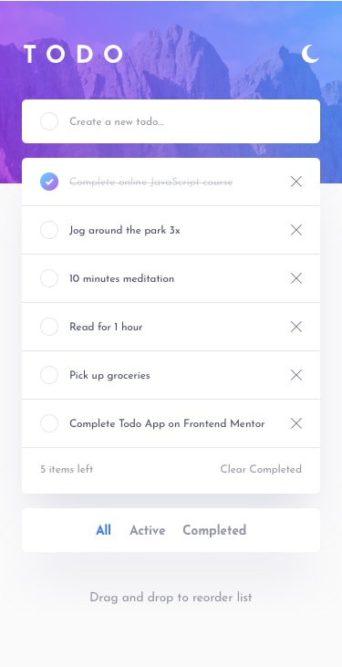

# Todo app solution

## Table of contents

- [Todo app solution](#todo-app-solution)
  - [Table of contents](#table-of-contents)
  - [Overview](#overview)
    - [The challenge](#the-challenge)
    - [Screenshot](#screenshot)
    - [Links](#links)
  - [My process](#my-process)
    - [Built with](#built-with)
    - [Dependencies](#dependencies)
    - [Running locally](#running-locally)
    - [What I learned](#what-i-learned)
    - [Continued development](#continued-development)
  - [Author](#author)

## Overview

### The challenge

Users should be able to:

- View the optimal layout for the app depending on their device's screen size
- See hover states for all interactive elements on the page
- Add new todos to the list
- Mark todos as complete
- Delete todos from the list
- Filter by all/active/complete todos
- Clear all completed todos
- Toggle light and dark mode
- Drag and drop to reorder items on the list
- Push notification for the active tasks.

### Screenshot

|                      Dark                       | Light                                            |
| :---------------------------------------------: | ------------------------------------------------ |
|  |  |

### Links

- Solution URL: [Solution URL here](https://www.frontendmentor.io/solutions/todo-app-E1WQLoL2_3)
- Live Site URL: [Live site URL here](https://app-todo-25.netlify.app/)

## My process

### Built with

- Semantic HTML5 markup
- CSS custom properties
- CSS Flexbox
- CSS Grid
- Mobile-first workflow
- MVC architecture
- ES6 Modules
- ES6 Classes

### Dependencies

- core-js
- regenerator-runtime
- transformer-sass
- parcel

### Running locally

From the repo:

- Fork the repo
- Clone it via command `git clone <URL of your forked repo>`
- cd `<forked repo directory>`
- Type `npm i` in your bash/command line
- Type `npm run build` in your bash/command line for production
- Type `npm start` to start your local development server

### What I learned

Now, I'm more confident in **MVC architecture**. Combining ES6 modules & ES6 classes to make a modular, scalable, & flexible app. Abstracted each function into a module. Further, I want to co-relate MVC architecture with React library.

### Continued development

Implementing this architecture using some frameworks/libraries such as ReactJS to optimize the app more & handle a large code base; coupled with both frontend & backend.

## Author

- Frontend Mentor - [@iprinceroyy](https://www.frontendmentor.io/profile/iprinceroyy)
- Twitter - [@prince_popups](https://www.twitter.com/@prince_popups)
